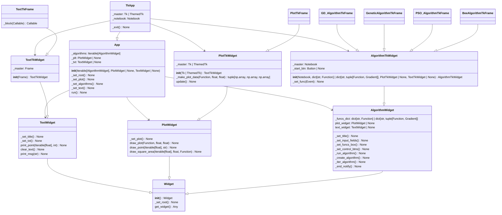
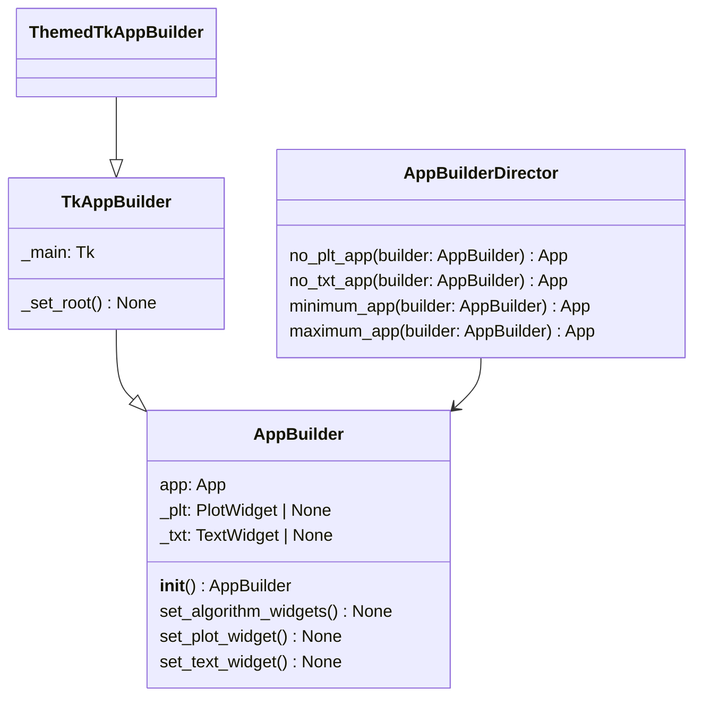

### app.py

```mermaid
classDiagram
    class App {
        _algorithms: Iterable[AlgorithmWidget]
        _plt: PlotWidget | None
        _txt: TextWidget | None
        __init__(Iterable[AlgorithmWidget], PlotWidget | None, TextWidget | None)
        _set_root() None
        _set_plot() None
        _set_algorithms() None
        _set_text() None
        run() None
    }

    class TkApp {
        _master: Tk | ThemedTk
        _notebook: Notebook
        _exit() None
    }

    class Widget {
        __init__() Widget
        _set_root() None
        get_widget() Any
    }

    class TextWidget {
        _set_title() None
        _set_txt() None
        print_point(Iterable[float], int) None
        clear_text() None
        print_msg(str) None
    }

    class TextTkWidget {
        _master: Frame
        __init__(Frame) TextTkWidget
    }

    class TextTkFrame {
        _block(Callable) Callable
    }

    class PlotWidget {
        _set_plot() None
        draw_plot(Function, float, float) None
        draw_point(Iterable[float], str) None
        draw_square_area(Iterable[float], float, Function) None
    }

    class PlotTkWidget {
        _master: Tk | ThemedTk
        __init__(Tk | ThemedTk) TextTkWidget
        _make_plot_data(Function, float, float) tuple[np.array, np.array, np.array]
        update() None
    }

    class PlotTkFrame {

    }

    class AlgorithmWidget {
        _funcs_dict: dict[str, Function] | dict[str, tuple[Function, Gradient]]
        plot_widget: PlotWidget | None
        text_widget: TextWidget | None
        _set_title() None
        _set_input_fields() None
        _set_funcs_box() None
        _set_control_btns() None
        _run_algorithm() None
        _create_algorithm() None
        _iter_algorithm() None
        _end_notify() None
    }

    class AlgorithmTkWidget {
        _master: Notebook 
        _start_btn: Button | None
        __init__(Notebook, dict[str, Function] | dict[str, tuple[Function, Gradient]], PlotTkWidget | None, TextTkWidget | None) AlgorithmTkWidget
        _set_func(Event) None
    }

    class GD_AlgorithmTkFrame {

    }
    class GeneticAlgorithmTkFrame {

    }
    class PSO_AlgorithmTkFrame {

    }
    class BeeAlgorithmTkFrame {

    }
    App --> TextWidget
    App --> PlotWidget
    App --> AlgorithmWidget
    TkApp --|> App
    TkApp --> TextTkWidget
    TkApp --> PlotTkWidget
    TkApp --> AlgorithmTkWidget
    TextWidget --|> Widget
    TextTkWidget --|> TextWidget
    TextTkFrame --|> TextTkWidget
    PlotWidget --|> Widget
    PlotTkWidget --|> PlotWidget
    PlotTkFrame --|> PlotTkWidget
    AlgorithmWidget --|> Widget
    AlgorithmTkWidget --|> AlgorithmWidget
    GD_AlgorithmTkFrame --|> AlgorithmTkWidget
    GeneticAlgorithmTkFrame --|> AlgorithmTkWidget
    PSO_AlgorithmTkFrame --|> AlgorithmTkWidget
    BeeAlgorithmTkFrame --|> AlgorithmTkWidget
```
### app_builder.py

```mermaid
classDiagram

    class AppBuilder {
        app: App
        _plt: PlotWidget | None
        _txt: TextWidget | None
        __init__() AppBuilder
        set_algorithm_widgets() None
        set_plot_widget() None
        set_text_widget() None
    }

    class TkAppBuilder {
        _main: Tk
        _set_root() None
    }

    class ThemedTkAppBuilder {
    }

    class AppBuilderDirector {
        no_plt_app(builder: AppBuilder) App
        no_txt_app(builder: AppBuilder) App
        minimum_app(builder: AppBuilder) App
        maximum_app(builder: AppBuilder) App
    }

    TkAppBuilder --|> AppBuilder
    ThemedTkAppBuilder --|> TkAppBuilder
    AppBuilderDirector --> AppBuilder
```